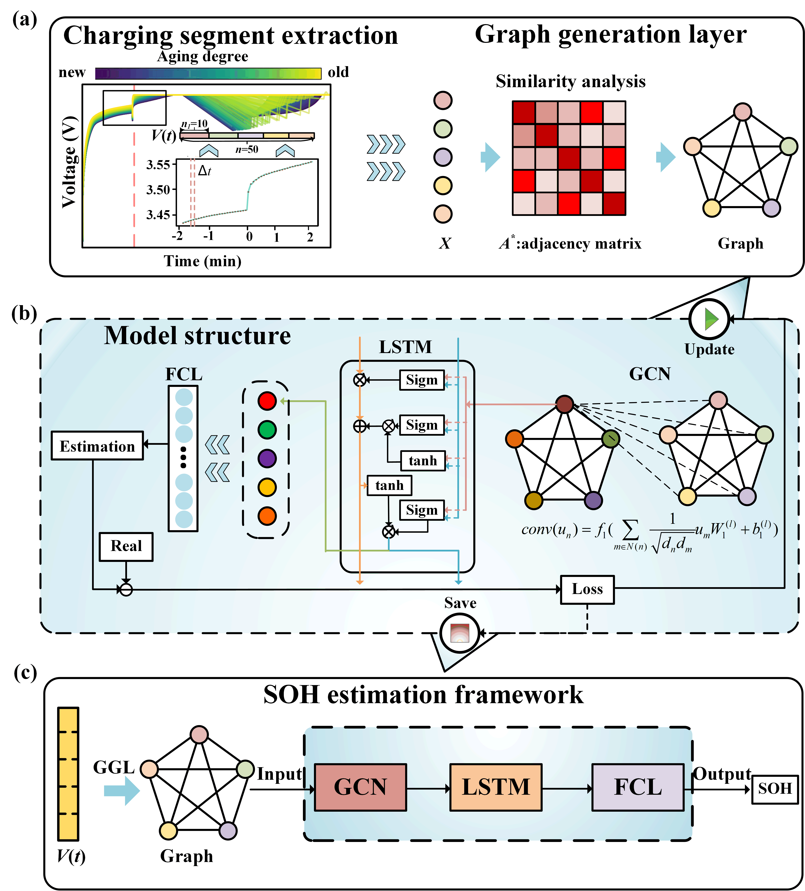
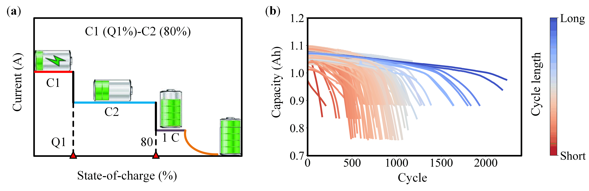
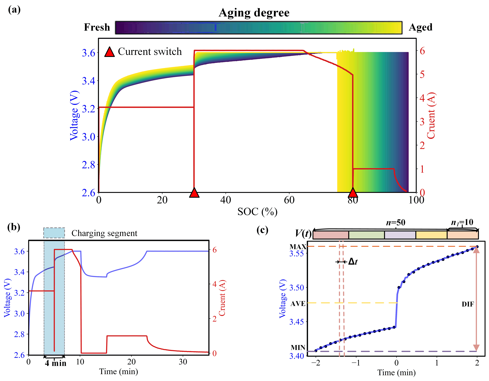
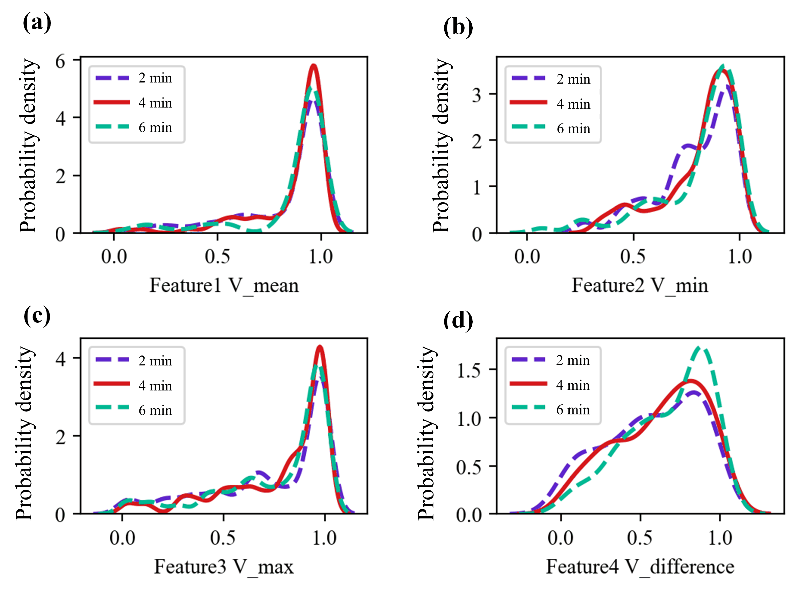
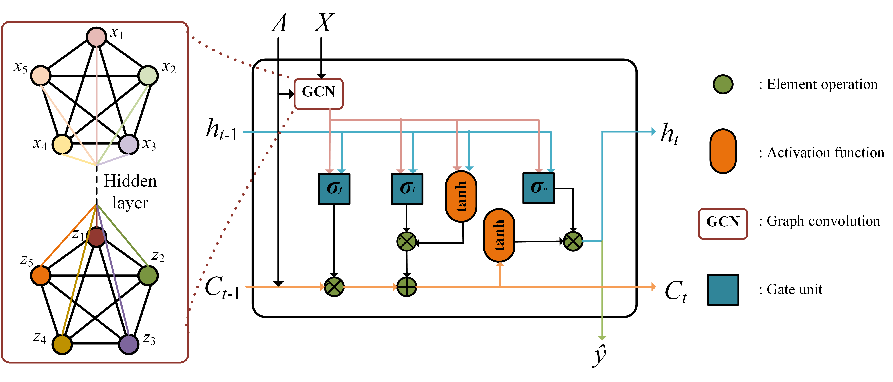
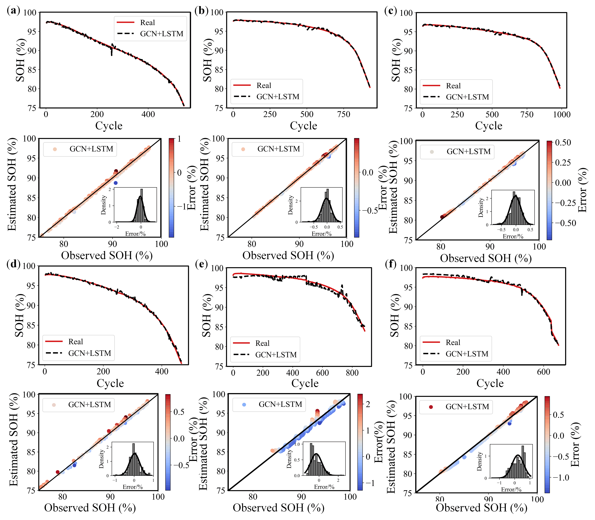
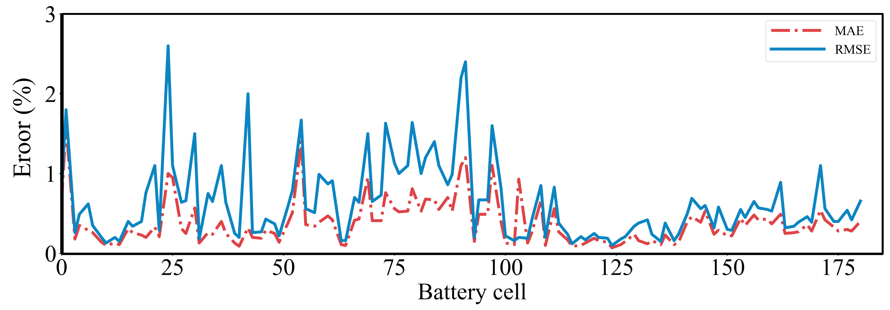
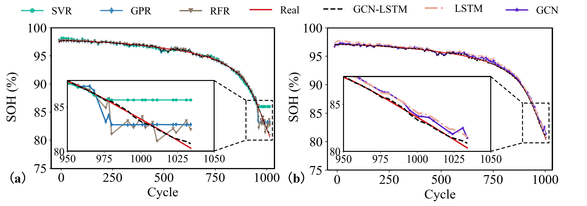
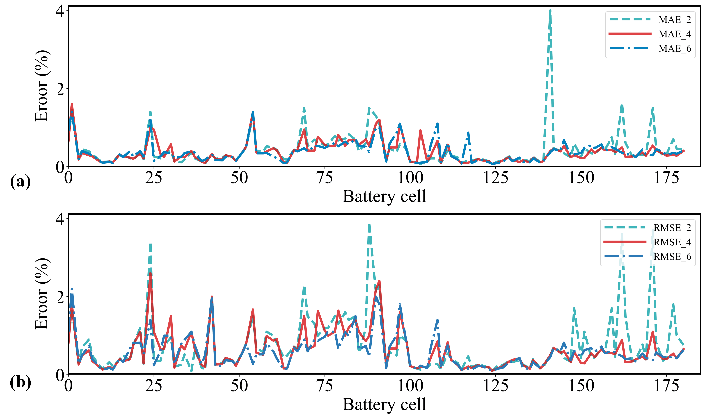
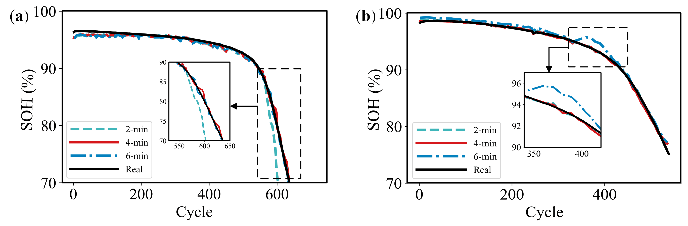

# 🔋 Battery SOH Estimation Using GCN-LSTM

This repository provides the official implementation of the paper:

> **State-of-health estimation for fast-charging lithium-ion batteries based on a short charge curve using graph convolutional and long short-term memory networks**  
> *Yuxin He, Zhongwei Deng, Jue Chen, Weihan Li, Jingjing Zhou, Fei Xiang, Xiaosong Hu*  
> [📄 Paper (Energy Journal, 2025)](https://doi.org/10.1016/j.jechem.2024.06.024)

---

## 📖 Abstract

An efficient health estimation method based on **short-term charging data**, integrating **Graph Convolutional Networks (GCN)** and **Long Short-Term Memory (LSTM)** networks, is proposed to accurately estimate the health of batteries during fast charging.  
The method extracts short charging segments around current switch points, transforms them into graphical representations, and employs a hybrid GCN–LSTM architecture to capture both **local** and **temporal** degradation features.  
Extensive experiments on **185 cells and 81 fast-charging policies** validate the high accuracy and generalization capability of the proposed method (MAE = 0.34%, RMSE = 0.66%).

---

## ⚙️ Method Overview

### 🔹 Technical Roadmap

> **Fig. 4.** Schematic of the proposed method:  
> (a) charging segment extraction, (b) structure of the GCN-LSTM model, and (c) complete workflow for SOH estimation.

---

## 📊 Dataset and Preprocessing

### 🔹 MIT–Stanford Battery Dataset

> **Fig. 1.** (a) Fast-charging policy and (b) battery lifespan under 81 distinct policies.

### 🔹 Feature Extraction

> **Fig. 2.** Extraction of voltage sequences near current switch points.

### 🔹 Correlation Analysis

> **Fig. 3.** Correlation distributions of voltage-sequence statistical features under different durations.

---

## 🧠 Model Architecture

### 🔹 GCN-LSTM Structure

> **Fig. 5.** Architecture of the proposed GCN-LSTM model.

| Layer | Type | Output | Activation |
|:------|:------|:---------|:------------|
| 1 | GCNConv | 80 | ReLU |
| 2 | GCNConv | 40 | ReLU |
| 3 | LSTM | 10 | — |
| 4 | FC | 1 | — |

---

## 🧪 Experimental Results

### 🔹 SOH Estimation under Fast-Charging Policies

> **Fig. 6.** SOH estimation results under different fast-charging policies.

### 🔹 Estimation Errors

> **Fig. 7.** Distribution of MAE and RMSE for 185 cells.

### 🔹 Comparison with Other Methods

> **Fig. 9.** Comparison of different SOH estimation methods (SVR, RFR, GPR, GCN, LSTM, and GCN-LSTM).

---

## 📈 Sensitivity Analysis

### 🔹 Influence of Segment Duration

> **Fig. 12.** Influence of charging segment duration on SOH estimation accuracy.

### 🔹 Results under Different Durations

> **Fig. 13.** SOH estimation performance under different charging durations.

---

## 📦 Repository Structure

